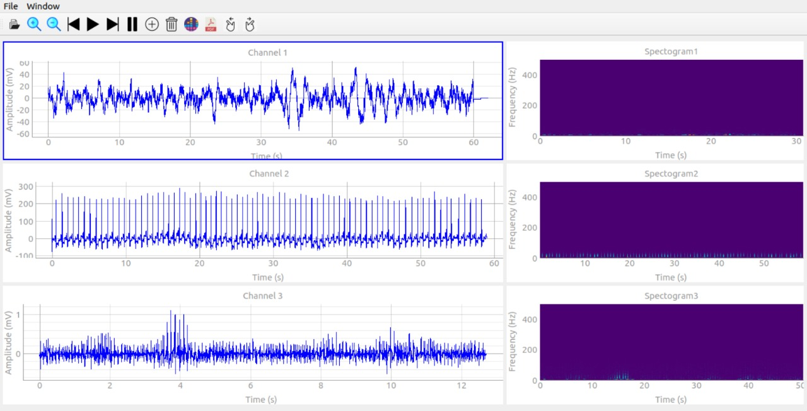

# Signal viewer

## Applying Medical signals like ECG, EEG and EMG

- The user can open up to 3 different signals.
- You can apply some options on selected signal like:
   * Zooming in or out
   * play / pause
   * moving forward or backward within the signal
   * to delete current signal to addanother one

  
- Each signal has its own spectrogram beside it.
- You can open more than window with same interface and options.
- You can save shown signals with their spectrograms in a *pdf*  file format.

***

It was a team project done by:

[Marwa Abdelaal](https://github.com/MarwaAbdelAal), 
[Meirna Kamal](https://github.com/Meirna-kamal), 
[Nada Ezzat](https://github.com/nadaezzat-99), 
[Noura Mahmoud](https://github.com/Noura-Mahmoud)

